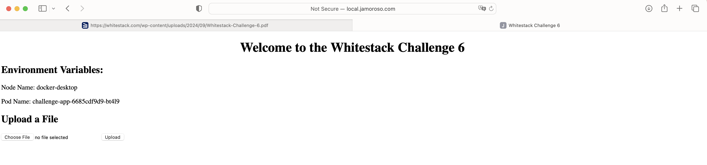
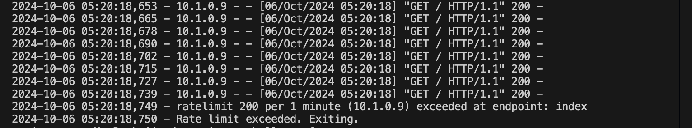
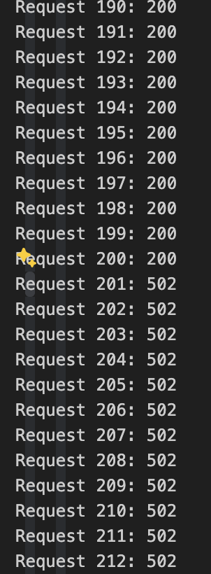
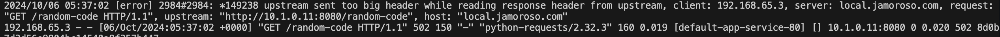
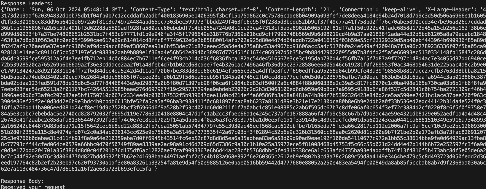
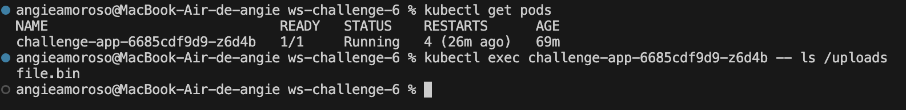
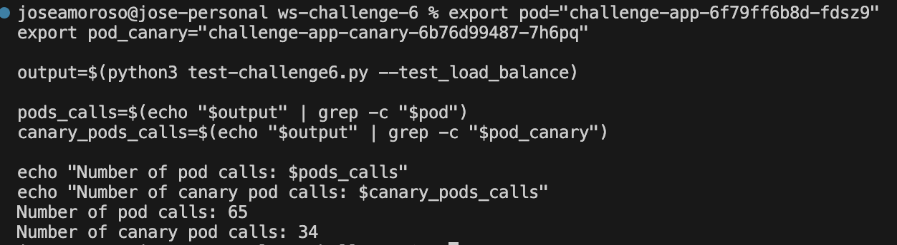

# WS-Challenge-06

1. [Deploy the application](#deploy-the-application)
2. [Send high load traffic](#send-high-load-traffic)
3. [Send Large headers requests](#send-large-headers-requests)
4. [Upload a file](#upload-a-file)
5. [Load balancing of requests](#load-balancing-of-requests)

## Deploy the application

We generate the script [set_hostname.sh](./set_hostname.sh) that will set the environment variable `INGRESS_HOSTNAME` for the domain that will be used by the application. The script will also update the loca `/etc/hosts` file to resolve the domain name locally. To execute the script we run:

```sh
source set_hostname.sh
```

> Keep in mind that this script needs `admin` permissions in order to modify the `/etc/hosts` file.

We also replace the host attribute in the `ingress.yaml` file with hostname defined in the prvious step. After that we deploy the kubernetes resources defined in this repo (deployment, service, and ingress):

```sh
kubectl apply -f ./
```

Now we access the application with the a browser and we see the following homepage:


## Send high load traffic

As we already set the env variable on the previous step, here we only need to run the python script to send the high load requests:

```sh
python3 test-challenge6.py --send_high_load
```

Next, we can see the logs output from the pod running the app:



From the Python script's logs we also see that the response code is `200` until the request 200, then we start receiving an error `502`.



**RCA**: If we access the container that is running the Python application, we can see it is using a Limiter that will restrict the requests to 200 calls per minute for the root path `/`, causing the application to exit if we pass the threshold.

**Fix**: To fix this issue, we can use the Nginx Controller Rate Limiting feature. This allow us to control the request frequency at the ingress layer, so that the traffic doesn't reach the service.

In this case, we used the k8s annotation: `nginx.ingress.kubernetes.io/limit-rpm` in the ingress for the app, which limits the number of requests per minutes at the ingress. To calculate the right value, we ned to consider that the value we set in the annotation will be multiplied by the burst multiplier (5 by default) to set a burst limit. Ref: <https://github.com/kubernetes/ingress-nginx/blob/main/docs/user-guide/nginx-configuration/annotations.md#rate-limiting>

Because the application is limited to 200 request per minutes, we need to use a smaller number to avoid reaching the limit. In this case, we will set the limit of request per minute to 195, which requires the following annotation: `nginx.ingress.kubernetes.io/limit-rpm: 39`.

> Note that 39 (limit-rpm) * 5 (burst multiplier) =  195.

We are also considering that for this example there is one user only, with the same IP for all the request, and all request are sent immediately. After adding the annotation mentioned before, we run the python script again:

```sh
python3 test-challenge6.py --send_high_load
```

Now the pod doesn't restart or show the `ratelimit` error message. Also, from the Python logs output, we see the request 197 to be the latest one returning a `200` status code.

From request 198 and on, we see a status code `503`, which differs from previous status code in the execution without the `nginx.ingress.kubernetes.io/limit-rpm` annotation. The reason of this is because the nginx controller returns and error 503 when the rating limit is exceeded.

Python output sample:

```log
...
Request 192: 200
Request 193: 200
Request 194: 200
Request 195: 200
Request 196: 200
Request 197: 200
Request 198: 503
Request 199: 503
Request 200: 503
Request 201: 503
Request 202: 503
...
```

## Send Large headers requests

To simulate this request we need to execute:

```sh
python3 test-challenge6.py --send_simple_request
```

Which generates a `502 Bad Gateway` error. We don't see error logs in the Python app, but from the nginx controller pods' logs we can see the following message:



**RCA:**Because of the error in the nginx-controller pods, we know this issue is caused because the nginx controller is not properly configured to receive headers with this (big) size.

**Fix:** We can configure nginx proxy buffer to process headerers with a bigger size.

The application uses a token of 4000 characteres

```python
# Generate a random token with 4000 characters
token_length = 4000
random_token = secrets.token_hex(token_length // 2) 
```

We used the following annotations to enable the proxy buffering and configure it to use 1 buffer with a size of 5k:

```yaml
nginx.ingress.kubernetes.io/proxy-buffering: "on"
nginx.ingress.kubernetes.io/proxy-buffer-size: "4k"
nginx.ingress.kubernetes.io/proxy-buffers: "1" 
```

As we need to support 4000 characters for the random token header, plus other headers, we need bigger number than 4k for the buffer size, and for this reason we used 5k.

Now if we run the python scrip again:

```sh
python3 test-challenge6.py --send_simple_request
```

We receive the following response, which means it's fixed now:



## Upload a file

To simulate a file upload process, we run:

```sh
python3 test-challenge6.py --send_file file.bin
```

This shows the following error:

```logs
An error occurred: 413 Client Error: Request Entity Too Large
for url: http://local.jamoroso.com/upload
```

**RCA**: This errors means the nginx ingress is not properly configured to process files with this size.

**Fix**: Update the nginx ingress configuration to increase the size of the file it can process.

We use the annotation:

```yaml
nginx.ingress.kubernetes.io/proxy-body-size: "4m"
```

This will allow the ingress to process files with a size up to 4MB. The `file.bin` file size is of 2MB, but we will use the double to support any other similar size.

If we now run the python script again, we have the following output:

```logs
File uploaded successfully: 200
```

We double-check that the file was uploaded into the container:



## Load balancing of requests

We need to generate a second version of the application and use Canary deployment to redirect only 30% of traffic to the new version and 70% to the previous one. As one requirement is to keep the same hostname, we can use the Canary deployment strategy available in the nginx controller.

The first step requires to duplicate the deployment and service we are using. We used the `canary` suffix for these resources ([deployment-canary.yaml](./deployment-canary.yaml))

We also duplicate the ingress, with the only difference that we need to use the following annotation in the new ingress:

```yaml
nginx.ingress.kubernetes.io/canary: "true"
nginx.ingress.kubernetes.io/canary-weight: "30"
```

This will the ingress that we are using a canary deployment and that the 30% of traffic will be redirected to this ingress when there is another ingress using the same `hostname`.

To test this is working, we execute the python script as follows:

```sh
python3 test-challenge6.py --test_load_balance
```

From the output we can that different pods are serving the same request, with the same hostname. To validate that the deployment is balancing the traffic properly, we can count the number of ocurrences from the our of the python script:

```sh
# Extract the pods names. In this case for example:
export pod="challenge-app-6f79ff6b8d-fdsz9"
export pod_canary="challenge-app-canary-6b76d99487-7h6pq"

output=$(python3 test-challenge6.py --test_load_balance)

pods_calls=$(echo "$output" | grep -c "$pod")
canary_pods_calls=$(echo "$output" | grep -c "$pod_canary")

echo "Number of pod calls: $pods_calls"
echo "Number of canary pod calls: $canary_pods_calls"
```



From the output we can see the canary pods calls number is 34, which is near the 30% of traffic balancing.

> The image v2 of the app is not working, so we are using the same image tag, but we can assume we have two different versions and use the naming convention to differentiate them.
